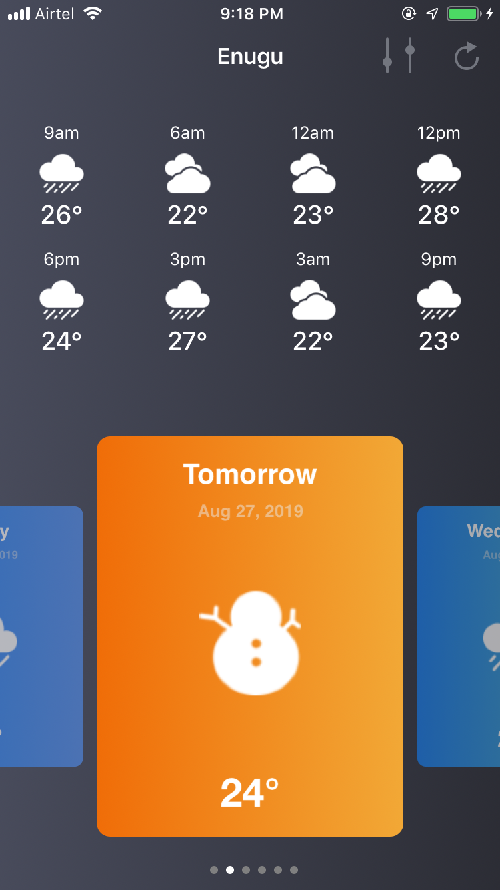
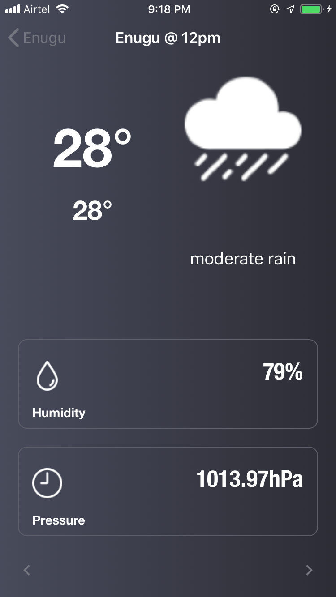
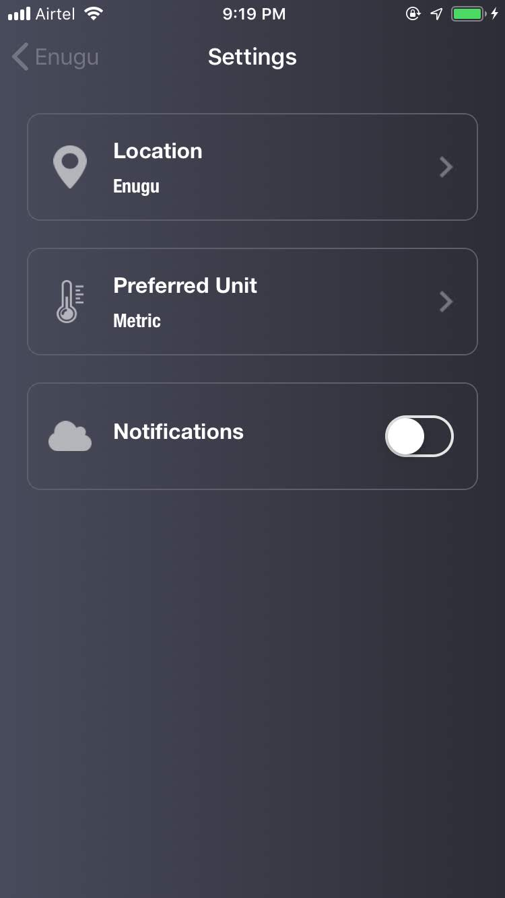

# Sunshine

Sunshine is a weather-tracking app that allows the user to query weather data from [OpenWeather API](https://openweathermap.org/forecast5) for five days at three-hour intervals.

A 5-day forecast is available at any location or city. It includes weather data every 3 hours. Forecasts are available in JSON or XML format.

For the purpose of this project, we consume all APIs in JSON.

## Installation

Sunshine uses external `Pods`.

- Step1: `cd` into `Sunshine` folder
`cd Sunshine`
- Run pod instal
`pod instal`
- Open `Sunshine.xcworkspace` and not `Sunshine.xcproject`

## Description

Sunshine is composed of three ViewController:

  
  
  

### HomeViewController

HomeViewControlle presents the five-day forecast in a swipeable view pager. Users can swipe to any day in the five days and the hourly forecast is displayed accordingly.

The pager card displays the date of the day, the appropriate weather icon, the temperature and the day as `Today`, `Tomorrow` or the day of the week if the day is not `Today` or `Tomorrow`.

The HomeViewController also has a `Page control Indicator` at the bottom of the swipeable pager which indicates the selected pager position.

The HomeViewController presents the 3 hourly forecasts in a grid of 8 items - which is the maximum forecast you can have for any given day.

When a forecast is tapped, the app navigates the user to the `DetailsViewController`.

### DetailsViewController

The `DetailsViewController` shows more info about the selected forecast including humidity, pressure max and min temp and the weather description.

To view other hours, you can tap the arrow - left and right - icons at the bottom of the screen.

The DetailsViewcontroller presents the icon of the selected forecast.

### SettingsViewController

The `SettingsViewController` enables the user to choose a location for the forecast, choose a preferred formatting unit - `Imperial` or `Metric` and also toggle notifications on and off.

## API

Suuchine consumes the following `REST` API from [OpenWeather API](https://openweathermap.org/forecast5)

- `api.openweathermap.org/data/2.5/forecast?q={city name},{country code}`

  `q city name and country code seperated by comma, use ISO 3166 country codes`

## Todo

- [] Implement notifications.
- [] Convert sicty names and zip-codes to geo code cordinates](https://openweathermap.org/api/geocoding-api)

## Dependencies and Pods

- CoreDate
- [Alamofire ~> 5.9.1](https://github.com/Alamofire/Alamofire)
- [RxSwift ~> 6.7.1](https://github.com/ReactiveX/RxSwift)
- [RxCocoa ~> 6.7.1](https://github.com/ReactiveX/RxSwift/tree/master/RxCocoa)
- [RxSwiftExt ~> 6.2.1](https://github.com/RxSwiftCommunity/RxSwiftExt)
- [RxOptional](https://github.com/RxSwiftCommunity/RxOptional)
- [SnapKit ~> 5.7.1](https://github.com/SnapKit/SnapKit)
- [FSPagerView ~> 0.8.3](https://github.com/WenchaoD/FSPagerView)
- [R.swift](https://github.com/mac-cain13/R.swift)
- [Then](https://github.com/devxoul/Then)
- [ActionSheetPicker-3.0 ~> 2.7.4](https://github.com/skywinder/ActionSheetPicker-3.0)
- [RxReachability ~> 1.2.1](https://github.com/RxSwiftCommunity/RxReachability)

## Focus

1. Making Network Request (Get, Post, Put, Delete)
2. Consuming web APIS / API intgrations
3. Parsing JSON file using Codable (Decodable, Encodable)
4. Asynchronous Requests
5. MVC Pattern with Network (Create Cleaner Code)GCD and Queues
6. Persisting app state and user data using `UserDefualt` and `CoreData`
7. Polished UI and a good UX

## Requirements

XCode >= 10.3
